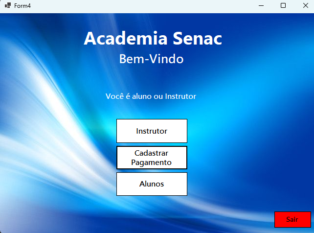

# Sistema de Gerenciamento de Academia

## 📌 Sobre o Projeto
Este projeto foi desenvolvido para auxiliar academias na **gestão de alunos, instrutores e pagamentos**.  
O sistema permite o **cadastro, edição e exclusão de dados**, além de emitir relatórios organizados sobre os pagamentos realizados e pendentes.

Ele foi construído utilizando:
- **C# WinForms** para interface gráfica;
- **MySQL** para banco de dados;
- **PDO/MySqlConnector** para integração segura com o banco;
- **Programação Orientada a Objetos (POO)** para organização do código.

---

## ⚙️ Funcionalidades
- **Cadastro de Alunos e Instrutores**  
  Permite registrar novos alunos e instrutores, armazenando dados essenciais.

- **Gerenciamento de Pagamentos**  
  Registra pagamentos realizados e controla o status de cada um (em dia ou pendente).

- **Relatórios**  
  Visualização clara de pagamentos **em dia** e **pendentes**, separados em grids distintos.

- **Interface Intuitiva e Simples**  
  Todas as telas seguem um padrão visual, facilitando o uso por usuários não técnicos.

---

## 🖼️ Telas do Sistema

### **1. Menu Principal**


Tela inicial do sistema, com botões que direcionam para:
- **Painel de Alunos e Instrutores**  
- **Gerenciamento de Pagamentos**  
- **Relatórios de Pagamentos**

---

### **2. Painel de Alunos e Instrutores**


Painel central para **navegação e controle de cadastros**, dividido em duas opções:
- Gerenciar **Alunos**
- Gerenciar **Instrutores**

---

### **3. Cadastro de Aluno**


Formulário para inserir os dados de um novo aluno na academia:
- Nome
- CPF
- Idade
- Contato
- Outras informações relevantes

---

### **4. Cadastro de Instrutor**


Formulário semelhante ao de aluno, destinado ao registro de instrutores.

---

### **5. Lista de Alunos**


Visualização de todos os alunos cadastrados no sistema.  
Funções disponíveis:
- **Editar** informações do aluno
- **Excluir** aluno do sistema
- **Pesquisar** rapidamente pelo nome

---

### **6. Lista de Instrutores**


Tela para visualizar todos os instrutores registrados.  
Funciona da mesma forma que a lista de alunos, permitindo edição e exclusão.

---

### **7. Gerenciar Pagamentos**


Tela utilizada para registrar os pagamentos dos alunos.  
Campos disponíveis:
- Selecionar aluno
- Inserir valor pago
- Escolher método de pagamento
- Registrar status (em dia ou pendente)

Botões principais:
- **Cadastrar:** Salva o pagamento no sistema.  
- **Excluir Selecionado:** Remove o pagamento selecionado.  
- **Voltar:** Retorna ao menu principal.

---

### **8. Relatório de Pagamentos**


Relatório que exibe os pagamentos organizados em duas tabelas:
- **Pagamentos em Dia:** Todos os alunos que estão com pagamentos atualizados.  
- **Pagamentos Pendentes:** Alunos que possuem mensalidades atrasadas.

Essa tela facilita o controle financeiro da academia e ajuda na tomada de decisões.

---

## 🗄️ Estrutura do Banco de Dados
O sistema utiliza três entidades principais no banco de dados:
- **Alunos**
- **Instrutores**
- **Pagamentos**

Relações:
- Cada pagamento está associado a **um aluno**.
- Os instrutores são cadastrados de forma independente.

---

## 🚀 Como Executar o Projeto
1. **Clone este repositório**
   ```bash
   git clone https://github.com/seu-usuario/seu-repositorio.git
